# 🚀 InternBridge: Premium Internship Management Platform


**InternBridge** is a modern, enterprise-grade SaaS application designed to connect top student talent with industry leaders. Built with a focus on premium aesthetics and seamless user experience, InternBridge eliminates the friction of traditional job hunting with unified role-based dashboards, interactive Kanban pipelines, and built-in interview preparation modules.

---

## ✨ Key Features

*   **Role-Based Dashboards:** Distinct, secure, and tailored experiences for **Students**, **Recruiters**, and **Admins**.
*   **Interactive Kanban Pipeline:** Recruiters can manage candidates via dynamic stage updates, which reflect instantly on the student's personal application tracker.
*   **Internship Readiness Score:** A gamified algorithm to encourage students to complete their profiles and help recruiters filter high-quality talent.
*   **Interview Preparations Module:** A dedicated interactive library with technical guides, behavioral (STAR) Q&A accordions, and mock interview tools.
*   **Premium UI/UX:** Clean, accessible design system inspired by top SaaS products (Notion, Linear), featuring soft shadows, muted slate palettes, and robust responsive layouts.

---

## 🔄 Workflow Diagram

Below is the high-level architecture of the user journeys for both Students and Recruiters on the platform.

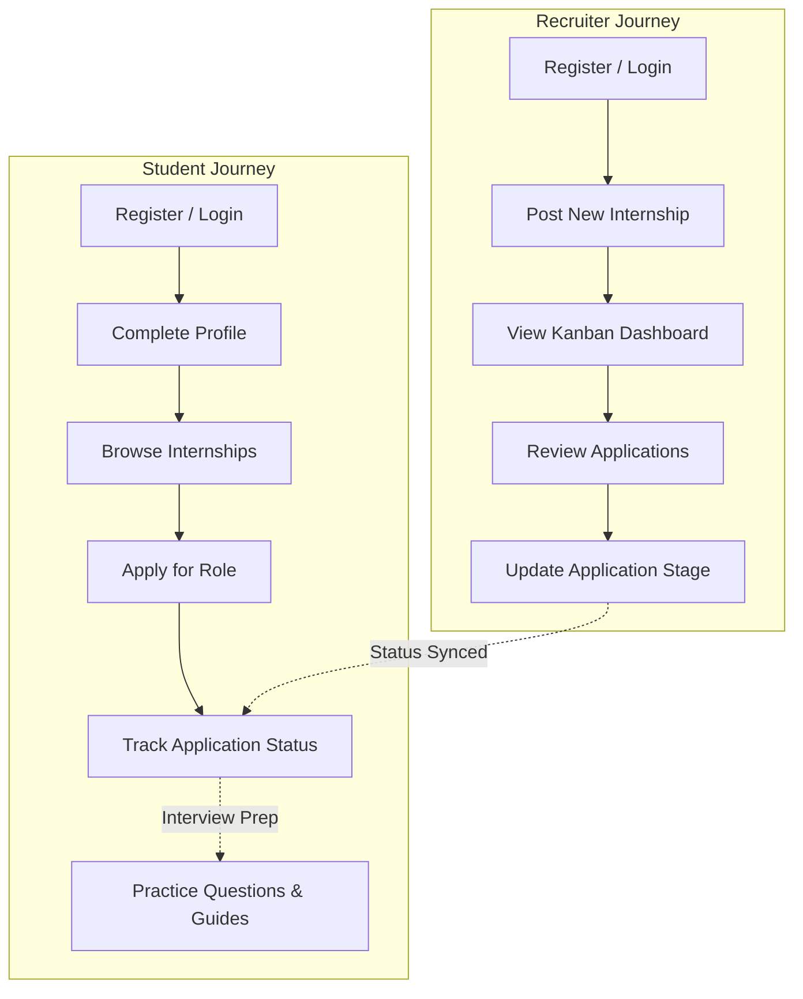

---

## 🎯 MVP Definition

The current version of InternBridge is scoped as a **Minimum Viable Product (MVP)** focusing on solving the core pain points of internship discovery and applicant tracking.

**In Scope (MVP):**
*   Dual-role authentication (Student & Recruiter).
*   End-to-end job posting and application flow.
*   Real-time applicant tracking via a Recruiter Kanban board.
*   Basic student profile gamification (Internship Readiness Score).
*   Static interview preparation resources.

**Out of Scope (Future Versions):**
*   In-app messaging or automated scheduling.
*   Advanced AI-based resume parsing.
*   Integration with external university portals (SSO).
*   Comprehensive Admin analytics dashboard.

---

## 📸 Platform Gallery

Here is a look at the InternBridge platform in action:

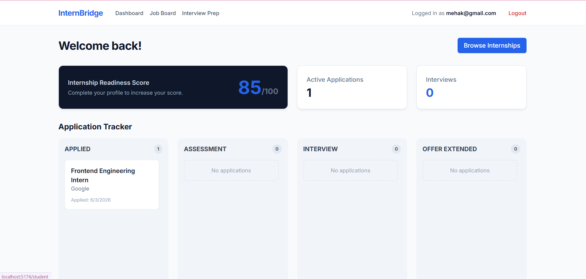
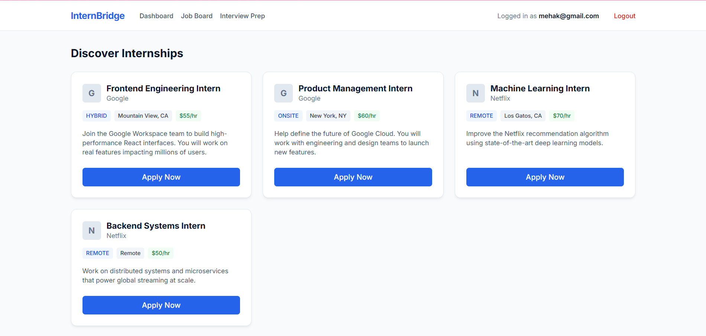
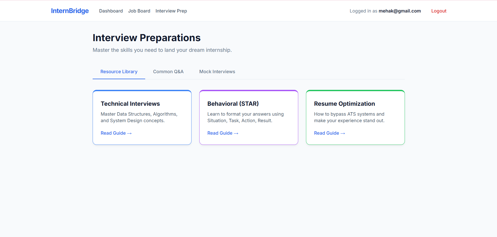
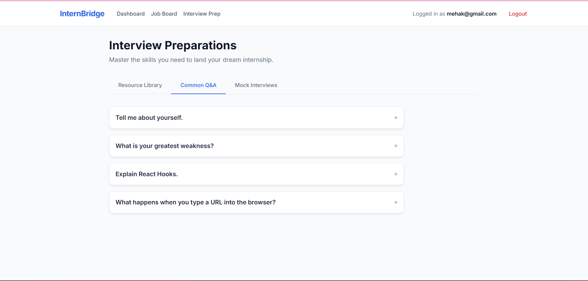
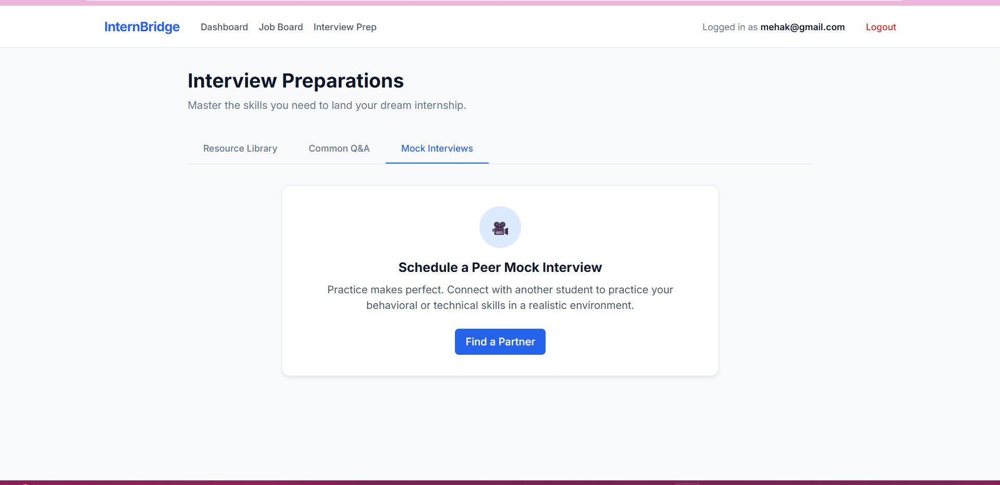
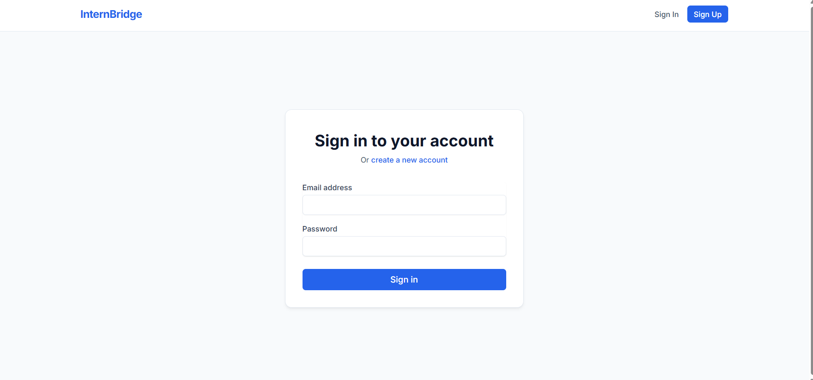
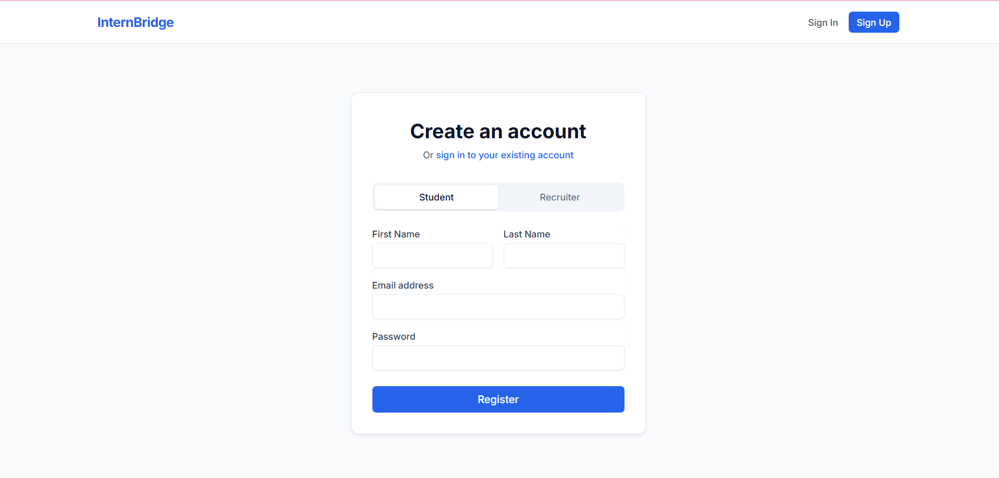
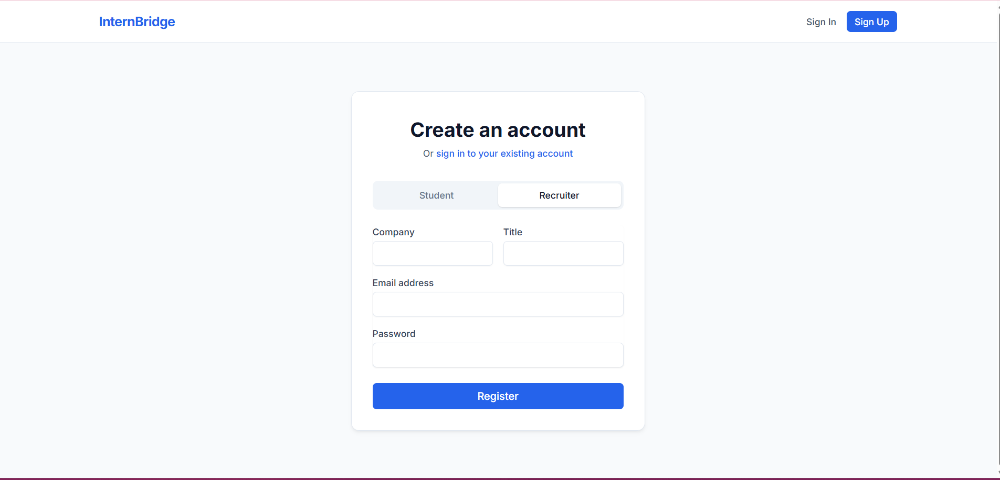
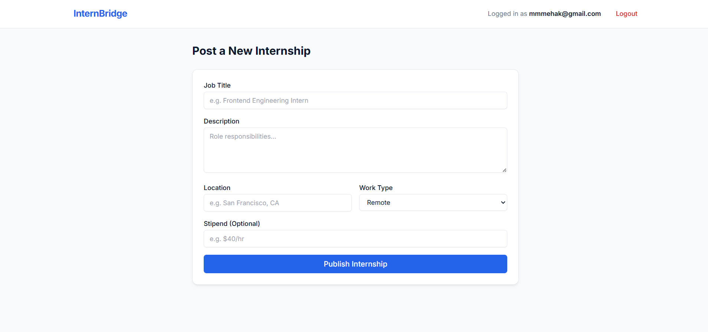
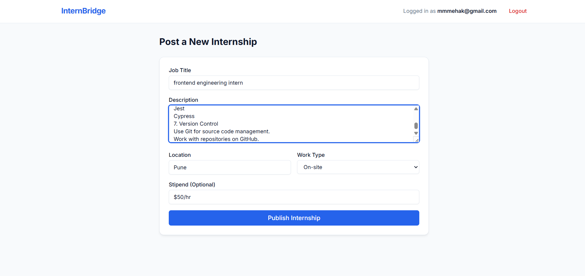
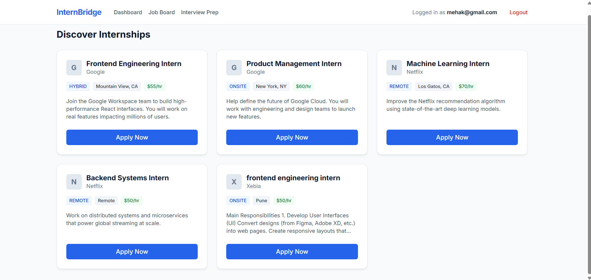

---

## 🛠️ Tech Stack

### Frontend
*   **Framework:** React 18 via Vite
*   **Language:** TypeScript
*   **Styling:** Tailwind CSS (v3.4.0) with custom Design Tokens
*   **State Management:** Zustand
*   **Routing:** React Router v6
*   **API Client:** Axios (with automatic JWT Interceptors)

### Backend
*   **Environment:** Node.js & Express.js
*   **Database:** MongoDB (via Mongoose)
*   **Authentication:** JWT (JSON Web Tokens) & bcryptjs for secure hashing
*   **Language:** TypeScript

---

## 🚀 Getting Started

Follow these instructions to run the project locally on your machine.

### Prerequisites
*   Node.js (v18 or higher)
*   MongoDB running locally on port `27017`

### 1. Backend Setup
Navigate to the backend directory and install dependencies:
```bash
cd internbridge/backend
npm install
```

Create a `.env` file in the `backend/` root:
```env
PORT=5001
MONGO_URI=mongodb://127.0.0.1:27017/internbridge
JWT_SECRET=your_super_secret_key_here
NODE_ENV=development
```

**Seed the Database:**
To instantly populate the application with premium jobs and mock recruiters, run the seeder:
```bash
npx ts-node src/seed.ts
```

Start the backend server:
```bash
npm run dev
```
*The API will run on `http://localhost:5001`*

### 2. Frontend Setup
Open a new terminal window, navigate to the frontend directory, and install dependencies:
```bash
cd internbridge/frontend
npm install
```

Start the Vite development server:
```bash
npm run dev
```
*The UI will run on `http://localhost:5174`*

---

## 📖 How to Use

1.  **Student Flow:** Register a Student account. Check out the **Interview Prep** tab to practice your skills. Head to the **Job Board** to view the seeded internships from Google and Netflix. Click **Apply**.
2.  **Recruiter Flow:** Register a Recruiter account. Click **Post New Internship** to add a job to the board. Your **Dashboard** will show a dynamic Kanban board of all students who have applied to your roles. Change their dropdown stage to see them move through your pipeline!

---

*Designed and Developed by the InternBridge Team.*
